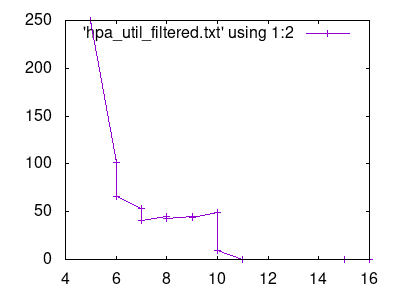
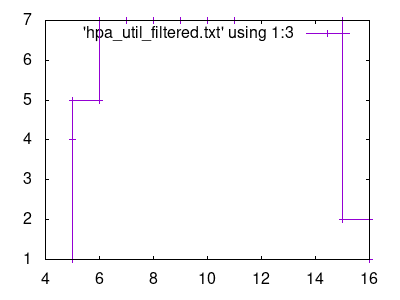

# Skálázás Horizontal Pod Autoscalerrel és CPU metrikával

## Deployment:

A skálázandó podok egy olyan apache+php konténereket tartalmaznak, amelyek CPU intenzív feladatot végeznek. Ebben a példában gyököt vonnak.

```
<?php
  $x = 0.0001;
  for ($i = 0; $i <= 1000000; $i++) {
    $x += sqrt($x);
  }
  echo "OK!";
?>
```

A Deploymentben be kell állítani a pod által használt CPU erőforrás felső korlátját (itt 500m) és azt, hogy legfeljebb milyen kihasználtsággal működő Node-ra lehet ütemezni (200m).

```
apiVersion: apps/v1
kind: Deployment
metadata:
  name: php-apache
spec:
  selector:
    matchLabels:
      run: php-apache
  replicas: 1
  template:
    metadata:
      labels:
        run: php-apache
    spec:
      containers:
      - name: php-apache
        image: k8s.gcr.io/hpa-example
        ports:
        - containerPort: 80
        resources:
          limits:
            cpu: 500m
          requests:
            cpu: 200m
```

Ezután meg lehet adni a HorizontalPodAutoscalert. Itt a hpa a podokat 1 és 10 között skálázhatja úgy, hogy minden Node lehetőleg 50%-os CPU kihasználtsággal működjön.

```
apiVersion: autoscaling/v2beta2
kind: HorizontalPodAutoscaler
metadata:
  name: php-apache
  labels:
    run: php-apache
spec: 
  scaleTargetRef:
    apiVersion: apps/v1
    kind: Deployment
    name: php-apache
  minReplicas: 1
  maxReplicas: 10
  metrics:
  - type: Resource
    resource:
      name: cpu
      target:
        type: Utilization
        averageUtilization: 50
```

Lefuttatva a `kubectl get hpa` parancsot, látható, hogy a CPU kihasználtság 0% és így 1 darab replikáns van a clusterben:

```
NAME         REFERENCE               TARGETS   MINPODS   MAXPODS   REPLICAS   AGE
php-apache   Deployment/php-apache   0%/50%    1         10        1          69m
```

Az alábbi paranccsal egy olyan podot hozunk létre, amely 100ms-ként küld egy HTTP GET üzenetet a skálázandó podoknak.

```
kubectl run -i --tty load-generator --rm --image=busybox --restart=Never -- /bin/sh -c "while sleep 0.01; do wget -q -O- http://php-apache; done"
```

Vizsgáljuk meg, hogy idővel hogyan változik a podok száma! Ehhez adjuk ki először a `kubectl get hpa --watch-only | ts | tee pod_num.txt` parancsot, majd futtasuk a fenti forgalomgenerátort. A kapott adatokat elmentettem egy fájlba, hogy innen kinyerve az időpontokat, a CPU kihasználtságot és a podok számát, azt egy grafikonon tudjam ábrázolni. Az adatok kinyeréséhez a `awk '{split($6, a, '/'); print $3, a[0], $9}'` parancsot használtam, majd a gnuplot nevű parancssoros függvényrajzoló programmal az alábbi ábrát kaptam.





Az első ábrát a `gnuplot -e "set terminal png size 400,300; set output 'util_plot.png'; plot 'hpa_util_filtered.txt' using 1:2 with linespoint"` parancs kiadásával kaptam, a másodikat a `gnuplot -e "set terminal png size 400,300; set output 'pod_no_plot.png'; plot 'hpa_util_filtered.txt' using 1:3 with linespoint"` parancs kiadásával.

Az első  ábrán látszik, hogy a terhelés kezdetén a podok átlagos CPU kihasználtsága az egekbe szökött, 250% volt. Ezután a második ábrán látszik, hogy a 6. perc környékén a podszámok megemelkedtek, mire a CPU kihasználtság a podokon csökkent. A terhelést a 10. perc környékén kapcsoltam le, ez látszik az első ábrán is. A podok száma viszont csak 5 perccel a terhelés megszüntetése után kezdtek el csökkenni, azért, mert a Kubernetes egy alapértelmezett esetben 5 percre állított időkeretben mindig a legnagyobb terhelést nézi. Ezzel a módszerrel simítja ki a gyorsan változó metrikus adatok hatásait.